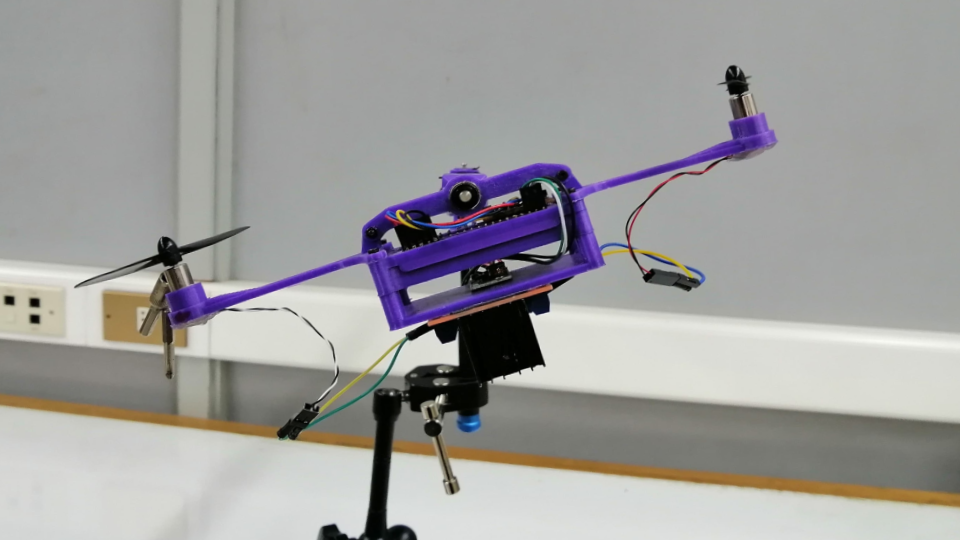

Este repositorio contiene los archivos STL para imprimir en 3D la plataforma de helicóptero de 3 grados de libertad (3-DOF) presentada en el paper: “A Low-Cost 3-DOF Helicopter Platform for Control Education: Integrating Digital Twins and Hardware-in-the-Loop”.

La plataforma está diseñada para educación en control y experimentación con sistemas mecatrónicos, permitiendo integrar gemelos digitales (digital twins) con hardware real (hardware-in-the-loop).

